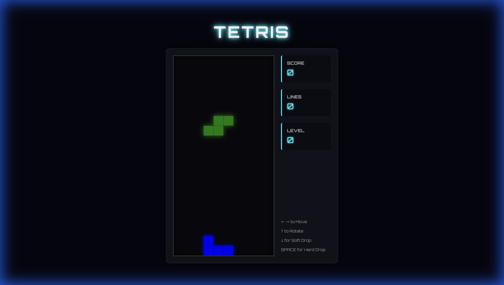

<div align="center">

  <h1>👾 Neon Tetris</h1>
  
  <p>
    <strong>A high-performance, cyberpunk-themed game built with the modern web.</strong>
  </p>

  <p>
    <a href="#-features">Features</a> •
    <a href="#-controls">Controls</a> •
    <a href="#-running-locally">Running Locally</a> •
    <a href="#-how-it-was-made">Development Story</a>
  </p>

  <p>
    
    
    
    
  </p>
  
  <br />

  

</div>

<br />

---

## ⚡️ Overview

**Neon Tetris** is a modern reimagining of the classic block-stacking puzzle game. Built to demonstrate clean architecture in vanilla JavaScript, it leverages **Vite** for a lightning-fast development experience and **HTML5 Canvas** for performant rendering. The aesthetic is inspired by cyberpunk visuals, featuring neon glows and a dark, immersive interface.

## ✨ Features

-   **🎛 Authentic Mechanics**: Implements the 7-bag randomization system (or standard random) for fair piece distribution.
-   **📈 Dynamic Difficulty**: Level up every 10 lines cleared, with speed increasing progressively.
-   **💯 Robust Scoring**:
    -   Chain combos with Single, Double, Triple, and Tetris clears.
    -   Reward risky play with Soft Drop and Hard Drop bonuses.
-   **🎨 Visual Polish**: Smooth rendering, ghost pieces (planned), and responsive design.

## 🕹 Controls

| Key | Action | Description |
| :--- | :--- | :--- |
| <kbd>←</kbd> | **Move Left** | Slide piece left |
| <kbd>→</kbd> | **Move Right** | Slide piece right |
| <kbd>↑</kbd> | **Rotate** | Rotate piece 90° clockwise |
| <kbd>↓</kbd> | **Soft Drop** | Accelerate descent for precision |
| <kbd>Space</kbd> | **Hard Drop** | Instantly lock piece in place |

## � Running Locally

Get the game running on your machine in seconds.

### Prerequisites

-   **Node.js** (v14 or higher)
-   **npm** (v6 or higher)

### Installation

1.  **Clone the repository** (if using git):
    ```bash
    git clone https://github.com/aimadesimple/tetris
    cd tetris
    ```

2.  **Install dependencies**:
    ```bash
    npm install
    ```

3.  **Start the dev server**:
    ```bash
    npm run dev
    ```

4.  **Play**:
    Open your browser to `http://localhost:5173` to start stacking!

## 📂 Project Architecture

The codebase is structured to be modular and readable, perfect for educational purposes.

```bash
src/
├── 🎮 Game.js      # Core game loop, state management, and orchestration.
├── 🧊 Board.js     # Grid logic, collision detection, and line clearing.
├── 🧩 Piece.js     # Tetromino definitions and movement mathematics.
├── ⌨️ Input.js     # Decoupled input handling system.
├── 🎨 Renderer.js  # Dedicated canvas drawing logic for separation of concerns.
└── ⚙️ Constants.js # Centralized configuration (speeds, colors, scoring rules).
```

## 🤖 How it was Made

> *"Built with a Single Prompt"*

This project stands as a testament to the power of AI-assisted development. It was conceptualized and generated using **Antigravity**. 

The agent was given a high-level goal: *"Create a Tetris game."* 
From there, it autonomously:
1.  **Designed** the project structure.
2.  **Selected** the tech stack (Vite + Vanilla JS).
3.  **Implemented** the core game logic and loop.
4.  **Styled** the application with a custom neon theme.

---

<div align="center">
  <sub>Built with ❤️ by Antigravity</sub>
</div>
